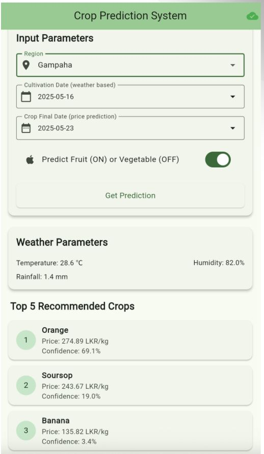
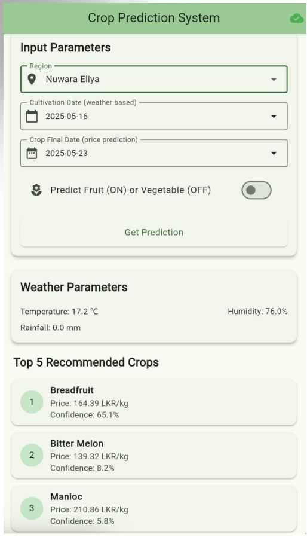

# FYP - Vegetable Stock Management and Crop Prediction System using Machine Learning

## Overview
This repository contains the Final Year Project (FYP) for a **Vegetable Stock Management and Crop Prediction System**. The system is designed to empower farmers, agricultural stakeholders, and vendors by providing data-driven recommendations on what crops (fruits and vegetables) to plant and predicting their future market prices.

The project integrates a mobile frontend application with a robust Machine Learning backend that factors in real-time climate data and historical pricing trends.

## Screenshots

Here is a glimpse of the application in action:

<div style="display: flex; justify-content: space-around;">
  
  
</div>

## Key Features
- **Intelligent Crop Recommendation**: Suggests the top 5 most viable crops based on the user's specific region and live weather data.
- **Dynamic Price Prediction**: Forecasts market prices (LKR/kg) using advanced machine learning regression models trained on extensive historical data.
- **Real-Time Climate Integration**: Pulls live 5-day weather forecasts (temperature, humidity, rainfall) via the OpenWeatherMap API to dynamically adjust recommendations.
- **Cross-Platform Mobile App**: A seamless, user-friendly Flutter app that allows farmers to easily request predictions on the go.
- **Separated Crop Logic**: Distinct modeling approaches and distinct user journeys for Fruits and Vegetables.

## System Architecture

The project is divided into two main components:

### 1. Frontend (`/crop`)
A cross-platform mobile application built using **Flutter**.
- **User Interface**: Provides an intuitive interface for users to select their region, harvest date, and crop type (fruit or vegetable).
- **Integration**: Communicates with the backend REST API to fetch and display predictions in a visually appealing card layout.

### 2. Backend & Machine Learning (`/final`)
A RESTful API server built with **Python** and **FastAPI**.
- **Real-time Weather Data**: Integrates with the **OpenWeatherMap API** to fetch 5-day climate forecasts (temperature, humidity, rainfall) for the specified region.
- **Crop Recommendation (Classification)**: Uses trained Scikit-Learn classification models (`model_cls.pkl`) to recommend the top 5 most viable crops based on environmental factors and location.
- **Price Prediction (Regression)**: Uses trained Scikit-Learn regression models (`model_reg.pkl`) to estimate the future market price (in LKR/kg) for the recommended crops.
- **Dataset**: Trained on comprehensive historical data combining climate conditions and crop prices (`Vegetables_fruit_prices_with_climate_130000_2020_to_2025.csv`).

## Technology Stack
*   **Frontend**: Flutter, Dart
*   **Backend**: Python 3.x, FastAPI, Uvicorn
*   **Machine Learning**: Scikit-Learn, Pandas, NumPy, Joblib
*   **External APIs**: OpenWeatherMap API

## Setup Instructions

### Backend (FastAPI + ML)
1. Navigate to the `final` directory:
   ```bash
   cd final
   ```
2. Create and activate a virtual environment (recommended):
   ```bash
   python -m venv venv
   source venv/bin/activate  # On Windows: venv\Scripts\activate
   ```
3. Install the required Python packages:
   ```bash
   pip install fastapi uvicorn pandas numpy scikit-learn joblib requests pydantic
   ```
4. Start the FastAPI server:
   ```bash
   python -m uvicorn main:app --reload
   ```
   The API will be available at `http://127.0.0.1:8000`. You can view the interactive API documentation at `http://127.0.0.1:8000/docs`.

*(Note: Ensure you have a valid OpenWeatherMap API key configured in `final/main.py` if the default one expires).*

### Frontend (Flutter)
1. Ensure you have the [Flutter SDK](https://docs.flutter.dev/get-started/install) installed.
2. Navigate to the `crop` directory:
   ```bash
   cd crop
   ```
3. Fetch the dependencies:
   ```bash
   flutter pub get
   ```
4. Run the application on your connected device or emulator:
   ```bash
   flutter run
   ```

## Machine Learning Workflow (`final/model_main.py` & `final/datset_separation.py`)
- The project involves splitting the massive dataset (~130,000 records) by fruits/vegetables and regions to create localized, highly accurate models.
- Models are trained and saved inside the `models/` directory using `joblib`.
- **Features Used**: `Region_encoded`, `Temperature`, `Rainfall (mm)`, `Humidity (%)`, `Crop Yield Impact Score`, and temporal data (`Day`, `Month`, `Year`).
- Separate Encoders (`label_encoder.pkl`, `region_encoder.pkl`) and Scalers (`scaler_cls.pkl`, `scaler_reg.pkl`) are maintained per region for accuracy.

## Future Enhancements
- Support for more localized regions within Sri Lanka.
- Historical price trend visualizations inside the Flutter App.
- Multi-language support (Sinhala/Tamil) for wider accessibility among local farmers.

## License
*This project is submitted as a Final Year Project.*